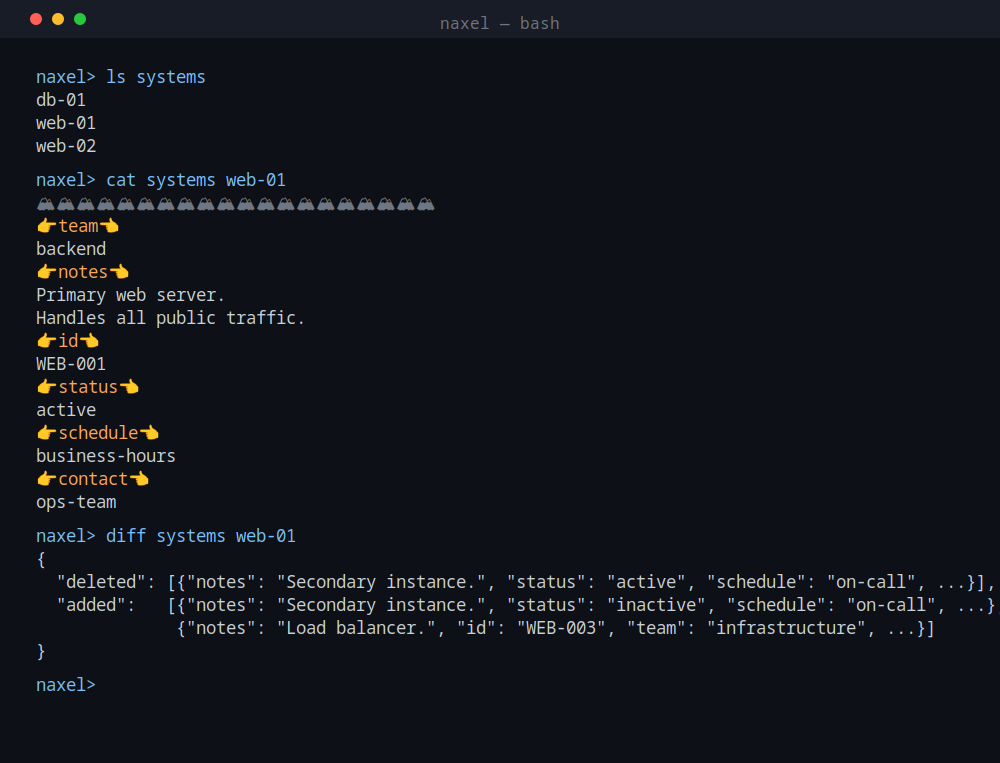
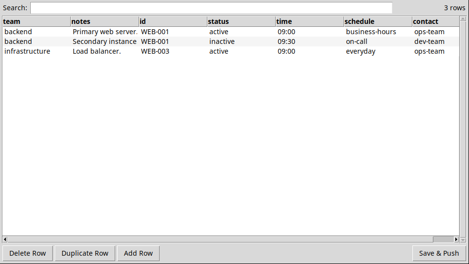
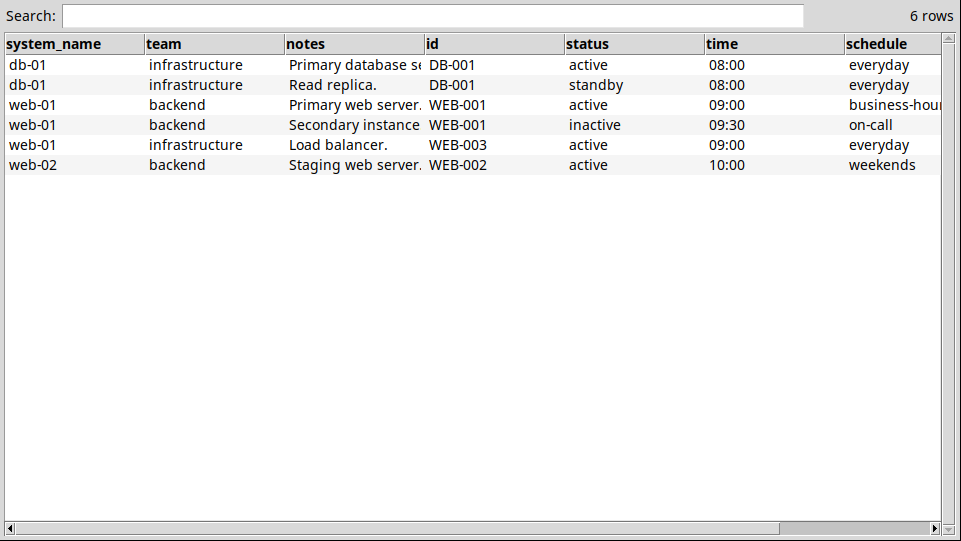
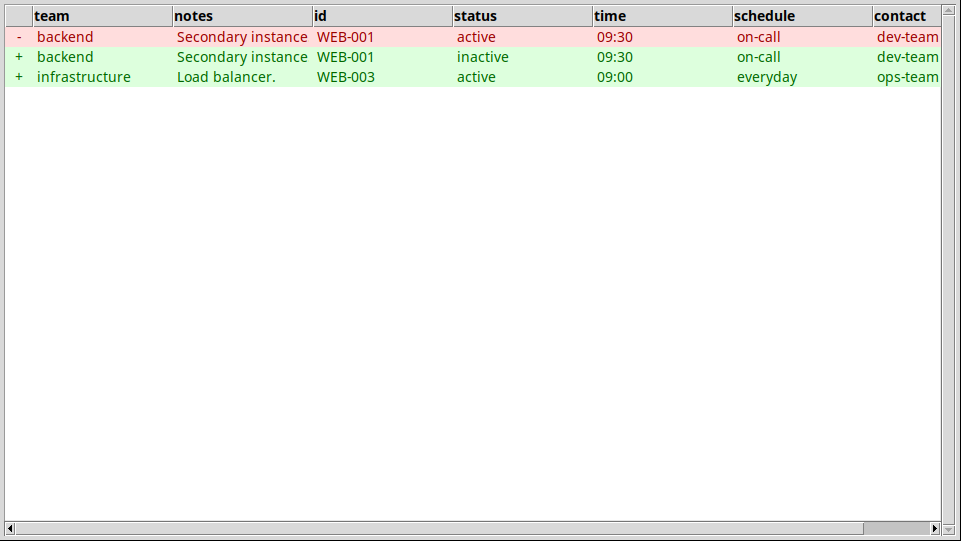
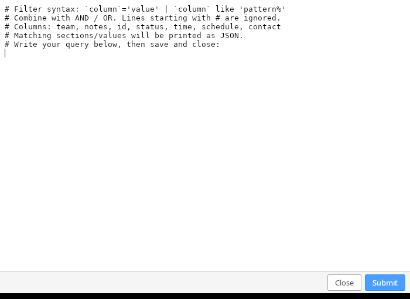

# naxel

A command-line tool for managing structured data stored in a file-based repository (local or NAS). Data lives in versioned, directory-organised files; naxel provides a REPL with commands for browsing, editing, validating, and exporting records — plus an optional JTable GUI for visual editing.

A parallel Rust/Tauri implementation (`src-rs/`) provides the same REPL plus native table windows via a bundled webview.

---

## Screenshots

### REPL session



### JTable — main collection (editable)



### JTable — export / cat (read-only with search)



### JTable — diff view



---

## Quick Start

**Requirements:** Python 3.10+

```sh
git clone <this-repo>
cd naxel
```

### Try the sample repository

The `samples/` directory contains a ready-to-run server-inventory repository with pre-populated data. `settings.ini` already points to it, so just run:

```sh
python3 src/app.py
```

Inside the REPL:

```
> ls systems
db-01
web-01
web-02

> cat systems web-01
🏔🏔🏔🏔🏔🏔🏔🏔🏔🏔🏔🏔🏔🏔🏔🏔🏔🏔🏔🏔
👉team👈
backend
👉notes👈
Primary web server.
Handles all public traffic.
👉id👈
WEB-001
👉status👈
active
👉time👈
09:00
👉schedule👈
business-hours
👉contact👈
ops-team
...

> export systems inventory.csv --jtable
```

### Create a new repository

Run the interactive wizard to bootstrap a fresh repository:

```sh
python3 src/app.py init /path/to/new-repo
```

The wizard asks for:
- Main collection name and its partitioning property (the entry-name column)
- Any number of columns — each with an optional validation type, multiline flag, and optional reference-collection wiring
- Column display order
- An introduction message shown at startup

It writes `repository.ini`, `additional_properties.json`, and `reference_collections.json`, and creates the collection directories. Then point `settings.ini` at the new directory and run the app.

### Use an existing repository

1. Edit `settings.ini` at the project root and set `repository.root` to your directory.
2. Run `python3 src/app.py`.

---

## Commands

### CLI-only (run before the REPL starts)

| Command | Description |
|---|---|
| `init <destination-directory>` | Bootstrap a new repository via an interactive wizard; creates the directory if absent |
| `update <destination-directory>` | Modify an existing repository's config via an interactive wizard |

### REPL commands

| Command | Description |
|---|---|
| `ls <collection>` | List all entry names in the collection |
| `add <collection> <name>` | Create a new entry with a blank template |
| `del <collection> <name>` | Soft-delete all versions of an entry (renames files to a dot-prefix; ignored by all read commands) |
| `cat <collection> <name>` | Print the latest version to stdout |
| `cat <collection> <name> --version=N` | Print a specific version to stdout |
| `cat <collection> <name> --jtable` | Open the latest version in a read-only JTable window |
| `cat <collection> <name> --version=N --jtable` | Open a specific version in a read-only JTable window |
| `cat <collection> <name> --json` | Print the latest version as JSON |
| `cat <collection> <name> --version=N --json` | Print a specific version as JSON |
| `get <collection> <name>` | Download the latest version and open it in your editor |
| `get <collection> <name> --jtable` | Download and open in an editable JTable window |
| `get <collection> <name> -` | Download; read new content from stdin (for pipelines) |
| `clear <collection> <name>` | Write a blank template and open it in your editor |
| `clear <collection> <name> --jtable` | Write a blank template and open it in JTable |
| `len <collection> <name>` | Print the number of non-empty records |
| `push <collection> <name>` | Validate the downloaded file and write it as the next version |
| `push <collection> <name> --json` | Same, but treat the downloaded file as JSON and convert first |
| `diff <collection> <name>` | Compare the latest two versions; print JSON with `deleted`/`added` |
| `diff <collection> <name> --jtable` | Same comparison in a colour-coded JTable window |
| `appenditems <collection> <name>` | Open a text editor with an empty record template; save and close to append new records to the entry and push |
| `appenditems <collection> <name> --json` | Same, but write the new records as a JSON array instead of 👉👈 text |
| `appenditems <collection> <name> -` | Read new records from stdin and append without opening an editor |
| `searchitems <collection> <name>` | Open a filter query editor; matching records printed as a JSON array to stdout |
| `searchitems <collection> <name> --json` | Same, but write the filter query as a JSON object instead of backtick syntax |
| `searchitems <collection> <name> -` | Read the filter query from stdin |
| `removeitems <collection> <name>` | Open a filter query editor; matching records removed, entry pushed, "removed N items" printed |
| `removeitems <collection> <name> --json` | Same, but write the filter query as a JSON object |
| `removeitems <collection> <name> -` | Read the filter query from stdin |
| `export <collection> <file.csv>` | Build a CSV from all entries and open it in your editor |
| `export <collection> <file.csv> --jtable` | Same, but open in JTable |
| `export <collection> <file.json>` | Build a JSON file from all entries |
| `fullcopy <dest-dir>` | Copy the entire repository (all versions) into `<dest-dir>/<repo-name>/` |
| `fullcopy <dest-dir> --json` | Snapshot the repository (latest versions only) as a single JSON file |
| `mkrepo <json-file> <dest-dir>` | Reconstruct a repository from a `fullcopy --json` snapshot |
| `partialcopy <collection> <name> <dest-dir>` | Copy the repository but blank out all entries except one |
| `partialcopy <collection> <name> <dest-dir> --json` | Same as a JSON snapshot |
| `cd <path>` | Switch to a different repository |
| `exit` | Quit |

### Batch mode

Run commands non-interactively with `-c`:

```sh
python3 src/app.py -c 'ls systems && cat systems web-01'
```

Chain a pipeline:

```sh
cat my-edited-file.txt | python3 src/app.py -c 'get systems web-01 - && push systems web-01'
```

---

## Configuration

### `settings.ini` (project root)

```ini
[repository]
root = /path/to/your/repo   # or a relative path such as dummy-repo

[editor]
command = mousepad          # editor opened by get / clear / export
```

### `repository.ini` (repo root)

```ini
[introduction]
message = Optional greeting shown at startup.

[main_collection]
collection_name = systems       # directory name and collection name for the main collection
partitioning_property = system  # first CSV column header
property_order = team,notes,id  # fields that appear first; others follow in declaration order
```

### `additional_properties.json`

Optional fields appended to every main-collection record:

```json
[
  {"property_name": "notes",  "validation_type": "NONE",      "multiline": true},
  {"property_name": "id",     "validation_type": "RE:[^#]+"},
  {"property_name": "status", "validation_type": "NOT_EMPTY"},
  {"property_name": "time",   "validation_type": "HH:MM"}
]
```

| `validation_type` | Rule enforced on `push` |
|---|---|
| `NONE` | Any value, including empty |
| `NOT_EMPTY` | Rejects empty values |
| `HH:MM` | Must match `\d{2}:\d{2}` |
| `MM/DD` | Must match `\d{2}/\d{2}` |
| `INT` | Must match `[0-9]+` |
| `YYYY` | Must match `\d{4}` |
| `RE:<pattern>` | Must fully match the given regex |

Set `"multiline": true` for fields that can span multiple lines. In JTable, double-clicking a multiline cell opens a modal editor instead of inline editing.

### `reference_collections.json`

Dynamic reference collections — each entry defines a collection of valid values:

```json
[
  {"collection_name": "teams",     "property_name": "team",     "type": "STRING",         "whitelist": []},
  {"collection_name": "schedules", "property_name": "schedule", "type": "DATE",         "whitelist": ["everyday", "weekends"]},
  {"collection_name": "contacts",  "property_name": "contact",  "type": "PHONE_NUMBER", "whitelist": ["none"]}
]
```

On `push`, every `property_name` field in main-collection records must be non-empty and must name an existing entry in the corresponding `collection_name` collection (or appear in its `whitelist`).

| `type` | Format validated in reference entries |
|---|---|
| `STRING` | No validation |
| `DATE` | Comma-separated `yyyy/mm/dd` |
| `PHONE_NUMBER` | Comma-separated `[0-9\-\+]+` |
| `EMAIL` | Comma-separated `user@domain.tld` |
| `YEAR` | Comma-separated `\d{4}` |

---

## Document Formats

### Main collection — editing format (👉👈)

`get` and `cat` show records in this separator format. `push` accepts it and converts to JSON before writing.

```
🏔🏔🏔🏔🏔🏔🏔🏔🏔🏔🏔🏔🏔🏔🏔🏔🏔🏔🏔🏔
👉team👈
backend
👉notes👈
Primary web server.
Handles all public traffic.
👉id👈
WEB-001
👉status👈
active
👉time👈
09:00
👉schedule👈
business-hours
👉contact👈
ops-team
```

Multiple records per file are separated by the `🏔` line. The blank template written by `add`/`clear` has the same structure with empty values.

### Reference collections

Plain text: comma-separated values on a single line.

```
2025/01/06,2025/01/07,2025/01/08,2025/01/09,2025/01/10
```

### CSV export

```csv
system, team, notes, id, status, time, schedule, contact
web-01, backend, Primary web server. Handles all public traffic., WEB-001, active, 09:00, business-hours, ops-team
web-01, backend, Secondary instance., WEB-001, active, 09:30, on-call, dev-team
```

Reference collections export as:

```csv
name, values
business-hours, 2025/01/06 2025/01/07 2025/01/08 2025/01/09 2025/01/10
```

---

## appenditems / searchitems / removeitems

These three commands operate on individual records within an entry without requiring a full `get` → edit → `push` cycle.

**`appenditems`** opens an editor pre-filled with a blank record template. After saving and closing, the new records are appended to the existing entry and pushed automatically. If the entry is in its initial all-blank state, the blank template is replaced rather than extended.

**`searchitems`** opens a filter query editor. After saving and closing, matching records are printed as a JSON array to stdout — useful for scripting.



**`removeitems`** works the same way but deletes matching records and pushes the result.

### Filter query syntax (default — backtick mode)

```
`column`='exact value'
`column` like 'prefix%'
`column` like '%suffix'
`column1`='val' and `column2` like 'pat%'
`column1`='val' or `column2`='other'
```

- `%` matches any sequence of characters; `_` matches any single character (SQL LIKE semantics).
- `and` binds tighter than `or`.
- An empty query (no conditions) matches nothing (returns `[]`).

### Filter query syntax (`--json` mode)

```json
{"column1": "exact value", "column2": "prefix%"}
```

- All key-value pairs are ANDed together.
- Values containing `%` or `_` are automatically treated as LIKE patterns.
- An empty object `{}` matches nothing (returns `[]`).

### Batch-mode examples

```sh
# Append a new record from a file
python3 src/app.py -c 'appenditems systems web-01 -' < new-section.txt

# Search and pipe results
python3 src/app.py -c 'searchitems systems web-01 - --json' <<< '{"status": "active"}'

# Remove all records matching a pattern
echo '`status`='"'"'deprecated'"'"'' | python3 src/app.py -c 'removeitems systems web-01 -'
```

---

## JTable search syntax

The read-only JTable (from `cat --jtable` and `export --jtable`) supports a query bar:

| Query | Behaviour |
|---|---|
| `foo bar` | Substring search across all columns |
| `where col = 'val'` | Exact match on `col` |
| `where col like 'pat%'` | SQL LIKE pattern (`%` = any chars, `_` = one char) |
| `where 'val' in col` | `val` is one of the comma-separated tokens in `col` |
| `where col.contents like 'pat'` | LIKE search on the raw content of a reference entry |
| `cond1 and cond2` | AND (binds tighter than OR) |
| `cond1 or cond2` | OR |
| `select count where cond` | Count matches without changing the view |
| `select prop.entry.contents` | Display the comma-split values of a specific reference entry |

---

## Rust/Tauri version

```sh
cargo build --release
./target/release/naxel              # REPL
./target/release/naxel -c 'ls systems'
```

The Rust binary supports the same commands and reads the same config files. `--jtable` commands open native webview table windows (fire-and-forget; the REPL continues immediately).

`init` and `update` are also available:

```sh
./target/release/naxel init /path/to/new-repo
./target/release/naxel update /path/to/existing-repo
```

---

## Repository layout

```
samples/
  repo/                           sample server-inventory repository
src/
  app.py                          Python REPL
  gui.py                          JTable GUI (tkinter)
src-rs/
  main.rs                         Rust REPL entry point
  commands.rs                     command implementations
  repo.rs                         repository state and cache sync
  ...
settings.ini                      points to samples/repo by default
```

---

## Documentation

| File | Description |
|---|---|
| [README.md](README.md) | English README (this file) |
| [README_ja.md](README_ja.md) | Japanese README / 日本語版README |
| [SPECIFICATIONS.md](SPECIFICATIONS.md) | English specifications — detailed technical reference |
| [SPECIFICATIONS_ja.md](SPECIFICATIONS_ja.md) | Japanese specifications / 日本語版仕様書 |
